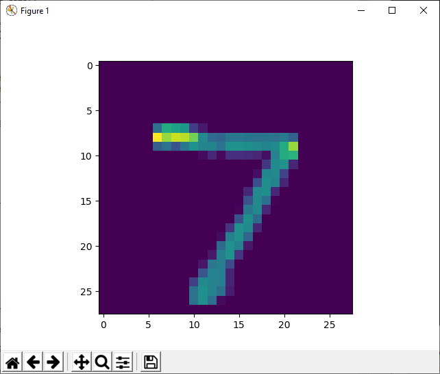

# Machine-Learning
**NMIST digit recognition** *(Deep Learning Neural Network w/TensorFlow, Keras)* 
Dataset: https://www.tensorflow.org/api_docs/python/tf/keras/datasets/mnist  
Loss: 0.09766  
Accuracy: 0.9677  
 
Sample *(Output=7)*:  
  
 
 
**Student Grade Prediction** *(Linear Regression w/scikit-learn, Pandas)*  
Dataset: https://archive.ics.uci.edu/ml/datasets/Student+Performance  
Accuracy: 0.8001768485127041  
Attributes *(coef)*: G1 *(0.1710371)*, G2 *(0.96936126)*, studytime *(-0.15492462)*, failures *(-0.3091488)*, absences *(0.03786174)*  
Intercept: -1.6234064847677985  

| Prediction  | Test Data | Actual |
| ------------- | ------------- | ----------- |
| 15.722374269942375  | [16 15  2  0 10]  | 15 |
| 9.777099507532856  | [10 10  1  0  4]  | 10 |
| 19.348372499737867 | [18 18  1  1 24] | 18 |
| 12.625572293130356 | [11 13  2  0  2] | 14 |
| 14.016208885952464 | [13 14  1  0  0] | 13 |
| ... | ... | ... |

 
 

**Car Safety Evaluation** *(KNN Classifier w/scikit-learn, Pandas)*  
Dataset: https://archive.ics.uci.edu/ml/datasets/Car+Evaluation  
Accuracy: 0.953757225433526  
 
Attribute Information:  
Class Values:  
unacc, acc, good, vgood  
 
Attributes:  
buying: vhigh, high, med, low.  
maint: vhigh, high, med, low.  
doors: 2, 3, 4, 5more.  
persons: 2, 4, more.  
lug_boot: small, med, big.  
safety: low, med, high.  
 
 

**Tumor Classification** *(Support Vector Machine w/scikit-learn, Pandas)*  
Dataset: https://scikit-learn.org/stable/modules/generated/sklearn.datasets.load_breast_cancer.html  
Accuracy: 0.9736842105263158  
Goal: Classifiy whether a breast tumor is benign or malignant. 
 
 
